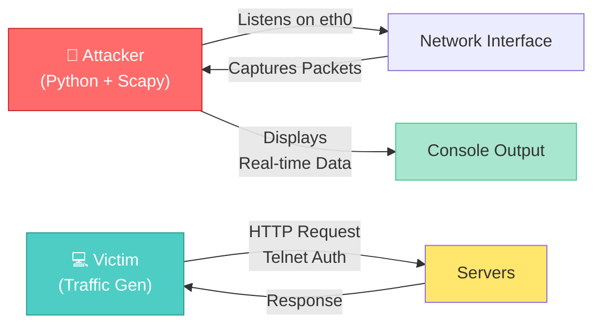
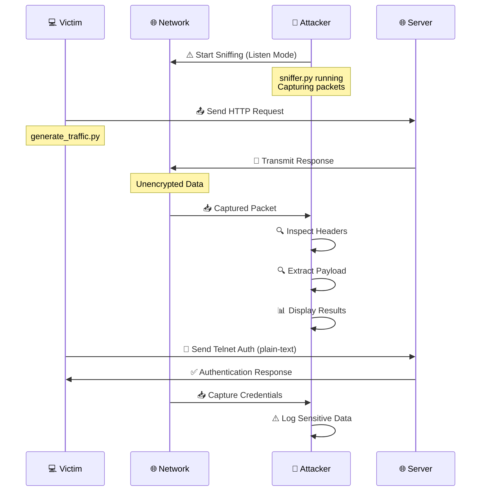

# 🔍 Network Security: Traffic Sniffing & Analysis Lab

> **A controlled, educational Docker-based laboratory environment for demonstrating network traffic generation, packet sniffing, and vulnerability analysis in clear-text protocols.**

[](LICENSE)
[](https://www.python.org/)
[](https://www.docker.com/)

---

## 📑 Table of Contents

- [✨ Features](#-features)
- [🎯 Overview](#-overview)
- [🏗️ Architecture](#️-architecture)
- [📋 Prerequisites](#-prerequisites)
- [🚀 Quick Start](#-quick-start)
- [🛠️ Step-by-Step Guide](#️-step-by-step-guide)
- [📂 Project Structure](#-project-structure)
- [🔄 Workflow](#-workflow)
- [💡 Key Concepts](#-key-concepts)
- [🐛 Troubleshooting](#-troubleshooting)
- [⚠️ Disclaimer](#️-disclaimer)

---

## ✨ Features

🎓 **Educational Focus**
- Designed for learning network security principles
- Demonstrates real packet sniffing techniques
- Shows vulnerabilities in unencrypted protocols

🔒 **Isolated Environment**
- Fully containerized using Docker Compose
- Safe, sandboxed network simulation
- No external network interference

🔌 **Multiple Protocol Support**
- HTTP (unencrypted web traffic)
- Telnet (legacy clear-text protocol)
- Easy to extend with custom protocols

⚡ **Real-time Analysis**
- Live packet capture and inspection
- Credential interception demonstration
- Payload analysis capabilities

---

## 🎯 Overview

This lab creates an isolated network environment to demonstrate how unencrypted protocols expose sensitive data to network sniffing. Four containers interact on a bridged Docker network:

| Component | Role | Purpose |
|-----------|------|---------|
| 🔴 **Attacker** | Passive Observer | Captures and analyzes network traffic |
| 💻 **Victim** | Traffic Generator | Simulates legitimate user connections |
| 🌐 **HTTP Server** | Service Provider | Serves unencrypted web content |
| 📞 **Telnet Server** | Service Provider | Provides clear-text authentication |

---

## 🏗️ Architecture

### System Architecture Diagram

```
┌─────────────────────────────────────────────────────────────┐
│                    Docker Network (Bridged)                 │
│                                                             │
│  ┌───────────────┐          ┌──────────────┐                │
│  │  🔴 Attacker  │          │  💻 Victim   │                │
│  │   (Sniffer)   │◄────────▶│   (Traffic   │                │
│  │               │          │  Generator)  │                │
│  └───────────────┘          └──────────────┘                │
│        ▲                            │                       │
│        │                            │                       │
│        │ (Captures packets)         │ (Sends requests)      │
│        │                            ▼                       │
│        │                    ┌──────────────┐                │
│        │                    │   🌐 HTTP    │                │
│        └────────────────────│   Server     │                │
│        │                    │              │                │
│        │                    └──────────────┘                │
│        │                            │                       │
│        │                    ┌──────────────┐                │
│        │                    │  📞 Telnet   │                │
│        └────────────────────│   Server     │                │
│                             │              │                │
│                             └──────────────┘                │
│                                                             │
└─────────────────────────────────────────────────────────────┘
```

### Container Interaction Flow



---

## 📋 Prerequisites

Before running this lab, ensure you have the following installed:

- 🐳 **[Docker](https://docs.docker.com/get-docker/)** (v20.10+)
- 🐳 **[Docker Compose](https://docs.docker.com/compose/install/)** (v1.29+)
- 💻 **Linux/Mac/Windows** (with Docker Desktop for Windows/Mac)

### Version Check

```bash
docker --version
docker-compose --version
```

---

## 🚀 Quick Start

Get the lab running in **3 easy steps**:

### 1️⃣ Build the Environment

```bash
# Navigate to the project directory
cd /home/afzal/Academic/Computer-Security/Packet-Sniffer

# Build and start all containers in the background
docker-compose up --build -d
```

### 2️⃣ Verify Containers

```bash
# Check all containers are running
docker-compose ps
```

Expected output:
```
CONTAINER ID   IMAGE              COMMAND                  STATUS
abc123def456   ...attacker        "python3 -u ..."         Up 2 minutes
xyz789uvw123   ...victim          "python3 -u ..."         Up 2 minutes
def456ghi789   ...http            "python3 http_server"    Up 2 minutes
ghi789jkl012   ...telnet          "/bin/bash"              Up 2 minutes
```

### 3️⃣ Start Sniffing!

```bash
# Terminal 1: Run the sniffer in the attacker container
docker exec -it packet-sniffer-attacker-1 python3 sniffer.py

# Terminal 2: Generate traffic from the victim container
docker exec -it packet-sniffer-victim-1 python3 generate_traffic.py
```

---

## 🛠️ Step-by-Step Guide

### Detailed Setup Instructions

#### Step 1: Prepare Your Environment

```bash
# Clone or navigate to the repository
cd /path/to/Packet-Sniffer

# Verify all Docker files exist
ls -la Dockerfile.* docker-compose.yml
```

#### Step 2: Build and Launch Containers

```bash
# Build images and start containers
docker-compose up --build -d

# Optional: View real-time logs
docker-compose logs -f
```

#### Step 3: Access the Attacker Container

```bash
# Get into the attacker container
docker exec -it <container-name> /bin/bash

# Verify Scapy is available
python3 -c "import scapy; print(scapy.__version__)"
```

#### Step 4: Run the Sniffer

```bash
# Start packet sniffing
python3 sniffer.py

# Output will show captured packets in real-time:
# [*] Sniffing on network...
# [+] Packet captured: ...
```

#### Step 5: Generate Network Traffic

In another terminal:

```bash
# Access the victim container
docker exec -it <victim-container-name> /bin/bash

# Trigger traffic generation
python3 generate_traffic.py
```

#### Step 6: Observe Results

Switch back to the attacker terminal to see live packet captures, including:
- 🌐 HTTP headers and payloads
- 👤 Telnet credentials
- 🔗 Connection details (IPs, ports, protocols)

---

## 📂 Project Structure

```yaml
Packet-Sniffer/
├── 📋 README.md                    # This comprehensive guide
├── 🐳 docker-compose.yml           # Container orchestration
│
├── 🐋 Dockerfile.attacker          # Attacker node (Python + Scapy)
├── 🐋 Dockerfile.victim            # Victim node (Traffic generator)
├── 🐋 Dockerfile.http              # HTTP server container
├── 🐋 Dockerfile.telnet            # Telnet server container
│
├── 🐍 sniffer.py                   # Main sniffing script (Attacker)
├── 🐍 generate_traffic.py          # Traffic generation script (Victim)
├── 🐍 http_server.py               # Simple HTTP server
└── 🖼️ [Diagrams & Documentation]
```

### File Descriptions

| File | Purpose | Key Features |
|------|---------|--------------|
| `docker-compose.yml` | Defines all containers and networking | Volume mapping, port binding, network config |
| `Dockerfile.attacker` | Attacker environment setup | Scapy, packet tools, Python3 |
| `Dockerfile.victim` | Victim environment setup | HTTP client, Telnet client, requests library |
| `sniffer.py` | Packet capture script | Real-time filtering, payload extraction |
| `generate_traffic.py` | Traffic generation script | Protocol simulation, automated requests |
| `http_server.py` | Basic HTTP server | Unencrypted responses, static content |

---

## 🔄 Workflow

### Complete Attack Simulation Flow



### Real-World Timeline

1. **Setup Phase** (1-2 minutes)
   - Start Docker environment
   - Containers initialize and connect to network

2. **Sniffing Phase** (Continuous)
   - Attacker starts listening on network interface
   - Ready to capture all traffic

3. **Traffic Generation Phase** (30 seconds - 5 minutes)
   - Victim initiates connections
   - Servers respond with data
   - Attacker captures packets

4. **Analysis Phase** (Real-time)
   - Displayed in attacker terminal
   - Credentials, headers, payloads visible

---

## 💡 Key Concepts

### What is Packet Sniffing?

Packet sniffing is the process of intercepting and capturing data traveling across a network. In unencrypted protocols, sensitive information becomes visible:

**Vulnerable Protocols:**
- 🌐 **HTTP**: Transmits headers, usernames, passwords in plain text
- 📞 **Telnet**: No encryption; all communication is readable
- 📧 **FTP**: Credentials transmitted without protection

**Protected Protocols:**
- 🔒 **HTTPS**: Encrypted communication layer (SSL/TLS)
- 🔐 **SSH**: Encrypted remote access

### Why This Matters

Understanding packet sniffing is crucial for:
- 🛡️ **Defensive Security**: Identifying vulnerabilities
- 📚 **Educational Purpose**: Learning network fundamentals
- 🔐 **Protocol Design**: Appreciating encryption importance

---

## 🐛 Troubleshooting

### Common Issues and Solutions

#### ❌ "docker-compose: command not found"
```bash
# Solution: Update installation path
# On Mac/Windows: Ensure Docker Desktop is installed and running
# On Linux: Install Docker Compose
sudo apt-get install docker-compose
```

#### ❌ "Port already in use"
```bash
# Find and stop conflicting container
docker ps -a
docker stop <container-id>
# Or modify ports in docker-compose.yml
```

#### ❌ "Containers not communicating"
```bash
# Check network status
docker network ls
docker network inspect <network-name>

# Restart containers
docker-compose restart
```

#### ❌ "Scapy import error"
```bash
# Verify installation
docker exec -it <attacker-container> pip list | grep scapy

# Reinstall if needed
docker exec -it <attacker-container> pip install scapy
```

#### ❌ "No packets captured"
```bash
# Check interface name in sniffer.py
docker exec -it <attacker-container> ip addr

# Verify network interface is correct (usually 'eth0')
```

### Debug Commands

```bash
# View container logs
docker-compose logs -f <service-name>

# Access container shell
docker exec -it <container-name> /bin/bash

# Check network connectivity
docker exec -it <container-name> ping <other-container>

# List open ports
docker exec -it <container-name> netstat -tlnp
```

---

## ⚠️ Disclaimer

**⚠️ EDUCATIONAL PURPOSES ONLY**

This project is strictly designed for:
- 📚 Academic learning and research
- 🏫 Computer security education
- 🔬 Understanding network protocols
- 🛡️ Defensive security training

**PROHIBITED USES:**
- ❌ Unauthorized access to networks/systems
- ❌ Intercepting data without permission
- ❌ Malicious purposes or illegal activities

**Legal Notice:** Unauthorized access to computer systems is illegal. Only use this lab on systems you own or have explicit written permission to test. Users are responsible for complying with all applicable laws and regulations in their jurisdiction.

---

## 📞 Support & Contributions

For issues, suggestions, or improvements:
- 🐛 Report bugs through GitHub Issues
- 💡 Propose features with detailed descriptions
- 📝 Contribute improvements via Pull Requests

---

<div align="center">

**Created for Computer Security Education** 🔐

*Last Updated: May 2026*

[↑ Back to Top](#-network-security-traffic-sniffing--analysis-lab)

</div>
